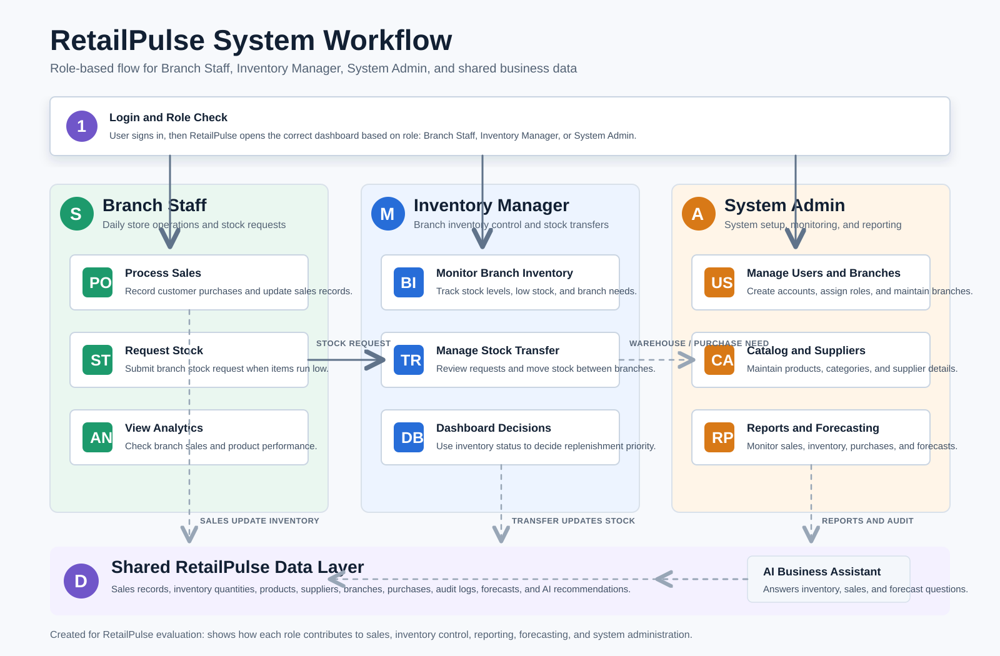

# RetailPulse

RetailPulse is a full-stack retail inventory and sales management system for multi-branch retail operations. It helps store administrators, inventory managers, and branch staff monitor stock levels, manage sales and purchases, coordinate stock transfers, review operational dashboards, and use AI-assisted business insights from the same application.

The objective of the system is to centralize retail operations so teams can make faster replenishment, sales, branch, and warehouse decisions with clearer data.

## Features

### System Administrator

- Authentication, session-based access, password reset, and role-based authorization
- Admin dashboard summary for sales, inventory, branch, and operational metrics
- User management for admins, inventory managers, and branch staff
- Branch and warehouse management
- Product catalog and category management
- Supplier and supplier-product management
- Purchase order creation, ordering, cancellation, receiving, and purchase recommendations
- Inventory overview across branches and warehouse
- Warehouse stock distribution and transfer approvals
- Sales monitoring, sale detail management, receipt PDF generation, and receipt email support
- Forecasting and reporting for product demand and predicted top sellers
- Activity/audit log review
- Database backup, verification, restore, download, and deletion workflows
- Floating AI assistant for inventory, sales, reorder, branch attention, and forecast questions

### Inventory Manager

- Manager dashboard for branch-level metrics
- Branch inventory view
- Stock transfer requests, approvals, receiving, history export, and printable transfer history
- Branch-scoped AI assistant responses

### Branch Staff

- Staff sales and branch workflows
- Staff analytics and stock request flow
- Receipt email workflow
- User profile and password management

## Technology Stack

### Frontend

- React 19
- Vite
- React Router
- Axios
- Tailwind CSS
- Recharts
- Framer Motion
- Lucide React

### Backend

- Python
- Flask
- Flask-CORS
- psycopg2
- python-dotenv

### Database

- PostgreSQL

### AI

- Google Gemini API
- Backend-generated inventory, sales, branch, and forecasting context
- Forecasting service exposed through Flask routes

### Other Libraries and Tools

- jsPDF and html2canvas for PDF/report export flows
- JMeter test plan and summary result artifacts under `testing/` and `jmeter_result/`
- PostgreSQL `pg_dump` and `psql` support for backup and restore workflows

## System Architecture

```text
React + Vite Frontend
        |
        v
HTTP requests with credentials
        |
        v
Flask REST API
        |
        v
PostgreSQL Database
        |
        v
Operational Data, Forecasting, Backups, and AI Context
        |
        v
Gemini API for AI Assistant Responses
```

## Folder Structure

```text
RetailPulse/
+-- backend/                  Flask backend application
|   +-- routes/               API route modules by domain
|   +-- services/             Backend service logic, including forecasting
|   +-- static/images/        Product image assets
|   +-- app.py                Flask application entry point
|   +-- config.py             Environment-based backend configuration
|   +-- db.py                 PostgreSQL connection helper
|   +-- requirements.txt      Python dependencies
|   +-- .env.example          Backend environment variable template
+-- frontend/                 React frontend application
|   +-- public/               Public frontend assets
|   +-- src/
|   |   +-- api/              Axios API configuration
|   |   +-- components/       Reusable React components
|   |   +-- layouts/          Dashboard layout components
|   |   +-- pages/            Role-based application pages
|   |   +-- utils/            Frontend utility functions
|   +-- package.json          Frontend scripts and dependencies
|   +-- vite.config.js        Vite configuration
+-- testing/jmeter/           JMeter non-functional test plan
+-- jmeter_result/            JMeter result summaries
+-- RetailPulse_Workflow.svg  Existing workflow diagram asset
+-- README.md                 Repository documentation
```

## Installation Guide

### Prerequisites

- Python 3
- Node.js and npm
- PostgreSQL
- Google Gemini API key, if using the AI assistant
- Gmail app password, if using email reset links or receipt email features

### Backend Setup

From the repository root:

```bash
cd backend
python -m venv venv
venv\Scripts\activate
pip install -r requirements.txt
```

Create a backend environment file from the example:

```bash
copy .env.example .env
```

Update `backend/.env` with local placeholder-specific values.

Run the backend:

```bash
python app.py
```

The backend is configured to run on `http://localhost:5000`.

### Frontend Setup

From the repository root:

```bash
cd frontend
npm install
npm run dev
```

The frontend development server normally runs on `http://localhost:5173`.

Useful frontend scripts already declared in `frontend/package.json`:

```bash
npm run dev
npm run build
npm run lint
npm run preview
```

### Database Setup

RetailPulse expects a PostgreSQL database configured through `backend/.env`.

At minimum, create a PostgreSQL database matching `DB_NAME` and ensure the configured `DB_USER` has permission to connect and read/write data. The repository includes demo data helper scripts, but it does not include a dedicated migration command in the current project files.

Optional helper scripts already present in `backend/`:

```bash
python seed_demo_data_keep_users.py
python generate_fake_sales.py
python generate_stock_transfer.py
python reset_demo_passwords.py
python migrate_password_hashes.py
```

Run helper scripts only after the required database schema exists.

### Environment Variable Setup

- Backend configuration is loaded from `backend/.env`.
- `backend/.env.example` contains placeholder values only.
- A root `.env.example` is also provided as a reference for GitHub readers.
- Never commit real `.env` files or real credentials.

### Running the Application

Start the backend first:

```bash
cd backend
venv\Scripts\activate
python app.py
```

Start the frontend in a second terminal:

```bash
cd frontend
npm run dev
```

Open the frontend URL shown by Vite, usually `http://localhost:5173`.

## Environment Variables

| Variable | Required | Description |
| --- | --- | --- |
| `SECRET_KEY` | Recommended | Flask secret key for sessions. Use a strong unique value outside development. |
| `DB_HOST` | Yes | PostgreSQL host, usually `localhost` for local development. |
| `DB_NAME` | Yes | PostgreSQL database name. |
| `DB_USER` | Yes | PostgreSQL username. |
| `DB_PASSWORD` | Yes | PostgreSQL password. |
| `DB_PORT` | Yes | PostgreSQL port, usually `5432`. |
| `FLASK_DEBUG` | No | Enables or disables Flask debug mode. |
| `SESSION_COOKIE_NAME` | No | Session cookie name used by Flask. |
| `SESSION_COOKIE_SAMESITE` | No | SameSite policy for the session cookie. |
| `SESSION_COOKIE_SECURE` | No | Set to `True` when serving over HTTPS. |
| `SESSION_LIFETIME_SECONDS` | No | Session lifetime in seconds. |
| `CORS_ORIGINS` | Yes | Comma-separated list of allowed frontend origins. |
| `GEMINI_API_KEY` | Required for AI | Google Gemini API key for the AI assistant. |
| `AI_DEBUG_LOGS` | No | Enables additional Gemini request/response logging when set to a truthy value. |
| `MAIL_USERNAME` | Required for email | Gmail address used for password reset and receipt emails. |
| `MAIL_PASSWORD` | Required for email | Gmail app password. Do not use a normal account password. |
| `FRONTEND_URL` | Required for reset links | Frontend base URL used in password reset emails. |
| `PG_DUMP_PATH` | Required for backups | Local path to `pg_dump` for database backup creation. |
| `PSQL_PATH` | Required for restores | Local path to `psql` for database verification and restore. |
| `PG_MAINTENANCE_DB` | No | Maintenance database used for restore operations, usually `postgres`. |
| `DEMO_PASSWORD` | No | Password used by the demo password reset helper script. |

## Screenshots

Existing visual assets are included below. Replace or expand these with real application screenshots when final screen captures are available.




<!-- TODO: Add real screenshots for login, admin dashboard, inventory overview, sales monitoring, forecasting, stock transfer, and AI assistant screens. -->

## Project Workflow

```text
User Login
    |
    v
Role-Based Dashboard
    |
    v
Inventory, Sales, Purchase, Branch, or User Operations
    |
    v
Flask API Validation and Authorization
    |
    v
PostgreSQL Data Update
    |
    v
Dashboards, Reports, Forecasting, Audit Logs, and AI Assistant Context
```

## Future Improvements

- Add database migration files and a clear schema setup command.
- Add automated backend tests for authentication, inventory, purchases, and stock transfers.
- Add frontend component and workflow tests.
- Add CI checks for linting and build verification.
- Add real screenshots or a short demo GIF to the README.
- Add API documentation for major backend routes.
- Add deployment instructions for production environments.
- Add optional Docker setup for easier local onboarding.
- Expand security documentation for session, CORS, backup, and credential handling.

## GitHub Topics

Recommended repository topics:

`react`, `vite`, `flask`, `postgresql`, `inventory-management`, `retail`, `sales-monitoring`, `forecasting`, `dashboard`, `ai-assistant`, `gemini-api`, `full-stack`, `warehouse-management`, `stock-transfer`, `analytics`

## Repository Quality Review

- Missing dedicated database migration or schema setup command.
- Missing real application screenshots for the main workflows.
- Missing API reference documentation.
- Missing CI configuration for lint/build checks.
- Optional badges could be added for license, frontend stack, backend stack, and project status.
- `backend/.env` exists locally; it is ignored by `.gitignore`, but verify it is not committed.
- `jmeter_result/` is currently untracked. Decide whether these result summaries should be committed as evidence or ignored as generated test output.
- Security note: development defaults in `backend/config.py` include fallback values for `SECRET_KEY` and `DB_PASSWORD`. Keep production secrets in environment variables and do not rely on fallback values outside local development.
- Security note: backup and restore features should remain restricted to trusted administrators because they interact directly with database dump and restore commands.

## Author

Cheng Kah Hooi

## License

This project is licensed under the MIT License. See [LICENSE](LICENSE) for details.
